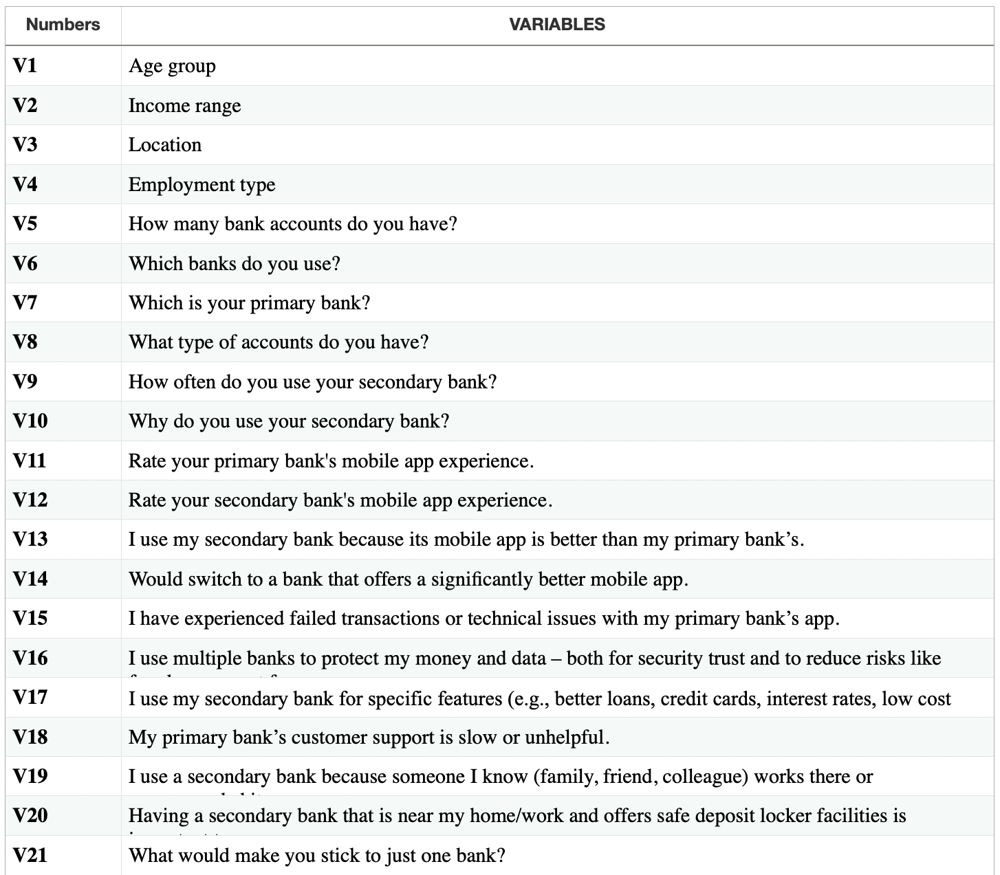

# Banking Survey Analysis 

MULTI-BANKING BEHAVIOR: ASSESSING THE INFLUENCE OF BANKING APP QUALITY AND OTHER FACTORS 🏦

Welcome to the **Multi-Banking Behavior** project!  
This project explores the increasing trend of consumers using **multiple banks**, identifying whether **mobile banking app quality** or **other factors** (like services, products, and security) are the main drivers.

---

## Project Overview

In an evolving financial landscape, many users now operate accounts with more than one bank. While the rise of digital banking plays a role, this study investigates a wider range of influences — including financial products, service quality, and personal preferences.

---

## Objective

1. Compare the impact of **mobile app quality** vs. **non-app factors** on multi-banking behavior.
2. Assess if better mobile app experience drives switching to secondary banks.
3. Identify non-app factors like **risk diversification**, **customer service**, and **recommendations**.
4. Explore potential improvements (e.g. fee elimination, better apps) to increase single-bank retention.

---

## Conceptual Framework

- **Dependent Variable**: Multi-Banking Behavior (use of ≥2 banks)
- **Independent Variables**:
  - 🟦 *Banking App Quality*: User experience, features, security
  - 🟨 *Risk Diversification*: Spreading financial risk
  - 🟧 *Customer Service Quality*: Responsiveness, complaint resolution
  - 🟩 *Product Superiority*: Specialized accounts, offers, interest rates
  - 🟥 *Family/Relational Influence*: Joint accounts, family suggestions
  - 🟪 *Ease of Mobility*: ATM/branch access, digital onboarding

---

## Key Research Questions

- **F1**: How does app quality affect multi-banking behavior?
- **F2**: Does fear of fraud or risk drive people to spread accounts?
- **F3**: Does poor service cause users to open secondary accounts?
- **F4**: Are specialized products a motivation to bank elsewhere?
- **F5**: Do family or relational ties result in multi-banking?
- **F6**: How much does convenience and mobility influence choice?

This section highlights the main questions used to assess what drives multi-banking behavior.

**List of questions made for assessing factors:**

---

## Data Collection

- **Method**: Structured questionnaire via Google Forms
- **Sample**: 100 voluntary and anonymous responses
- **Focus**: Banking habits, app satisfaction, service perceptions, convenience, trust, financial incentives

---

## Methodology

- **Data Cleaning & Processing**: Python
- **Statistical Analysis**: SPSS
- **Visualization**: Tableau Dashboards

### Techniques Used:
- **Discriminant Analysis (DA)**: Identify key factors separating single-bank vs. multi-bank users.
- **Principal Component Analysis (PCA)**: Reduce dimensions and discover core driving constructs.

---

## Visual Outputs

- Tableau charts showing relationships between demographics, motivations, and banking choices
- Comparative visual insights between app users and traditional users

---

## Project Files

- `survey-data.csv` – Anonymized dataset
- `analysis.ipynb` – Python data prep and transformation
- `tableau-dashboard.twbx` – Interactive Tableau dashboard
- `project-report.docx` – Full project documentation

---

## Summary

This project offers insights for banks to understand the complex, multi-factor reasons behind consumers' choice to engage with multiple institutions — beyond just digital convenience. It provides analytical groundwork for improving services and app experiences to boost customer loyalty.

---

*Made with ❤️ using SPSS, Python & Tableau*

