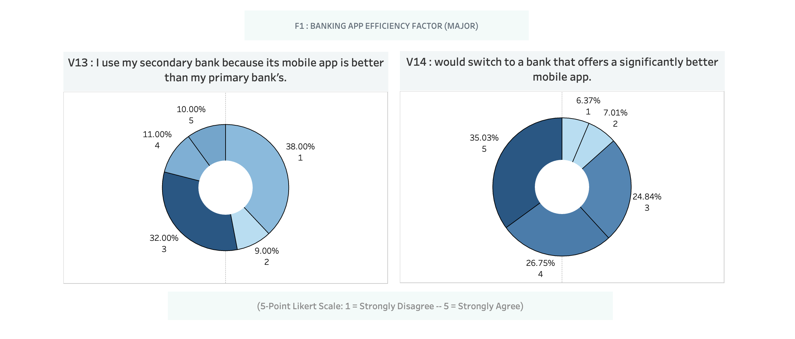
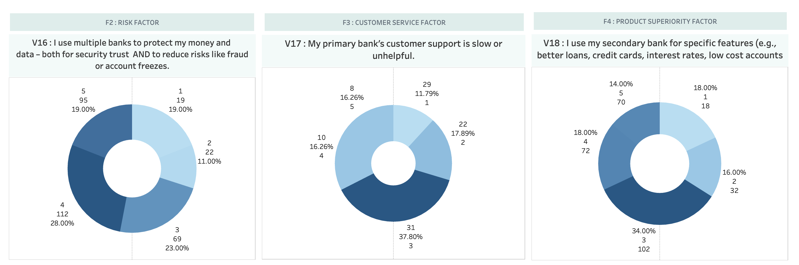
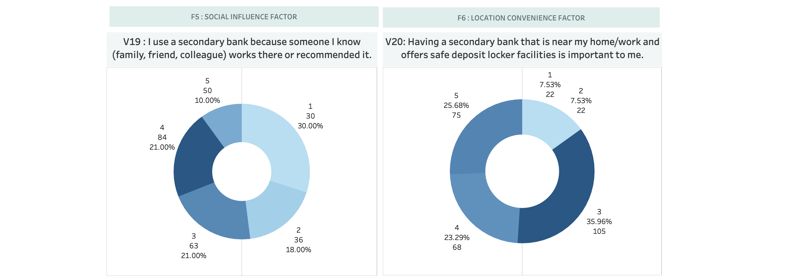
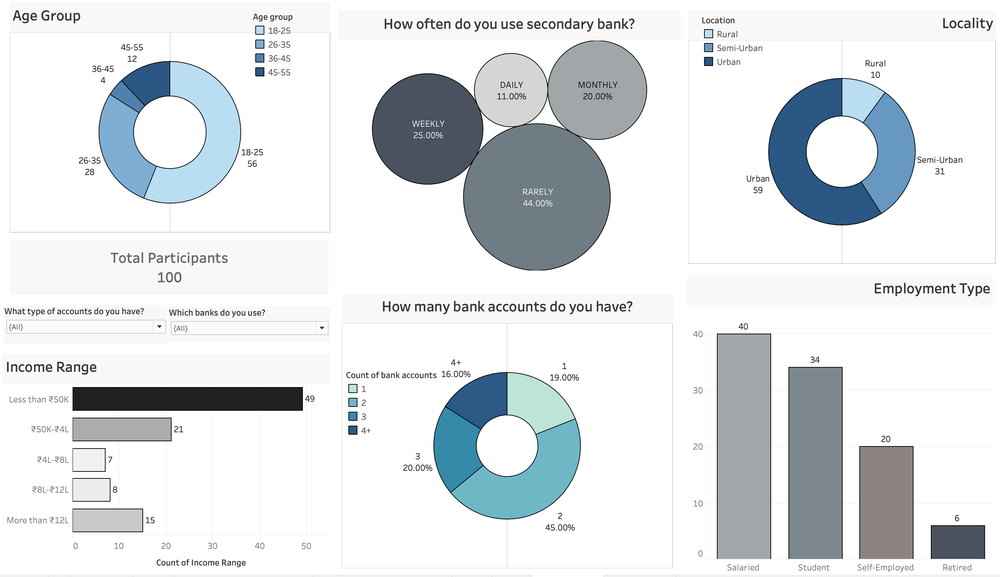

# Part 1: Survey Questions, Factor Breakdown & Dashboard Visuals

---

## 1️⃣ Survey Questions Overview

This table shows the 21 variables used in the study. It covers demographics (like age, income), banking behavior, and user perceptions related to banking apps and services. These questions shaped the entire research foundation.

---

## 2️⃣ Factor-wise Insights

The Likert-scale responses were grouped into meaningful "factors" to identify what influences people to use multiple banks.

### 🔹 F1: Banking App Efficiency (Major Factor)

**Insight**: Users tend to choose a secondary bank if its mobile app offers a better user experience. Mobile app quality is a major motivator for switching.

---

### 🔹 F2–F4: Risk, Customer Service & Product Superiority

**F2: Risk Factor**  
Respondents use multiple banks to ensure security and reduce risks such as account freezes or fraud.

**F3: Customer Service Factor**  
Poor service from the primary bank encourages customers to use alternatives.

**F4: Product Superiority Factor**  
People prefer banks with better financial products (e.g., loans, interest rates, credit cards).

---

### 🔹 F5–F6: Social Influence & Location Convenience

**F5: Social Influence**  
Family or peer recommendations significantly influence secondary bank usage.

**F6: Location Convenience**  
Users prefer banks close to home or work and those offering convenient facilities like lockers.

---

## 3️⃣ Tableau Dashboard Summary

**Dashboard Highlights**:

- Majority are aged **18–25**, mainly **salaried or students**, and live in **urban or semi-urban** locations.
- **45%** of respondents have **2 bank accounts**, and **44%** rarely use their secondary bank.
- A large share earn **less than ₹50K/month**, making affordability and service quality crucial factors.

This dashboard gives a clear, visual understanding of the audience, their preferences, and banking behavior — useful for quick recruiter insights.

---

Next up: [Part 2](../part2_python_cleaning/) – Data cleaning and preprocessing in Python.

